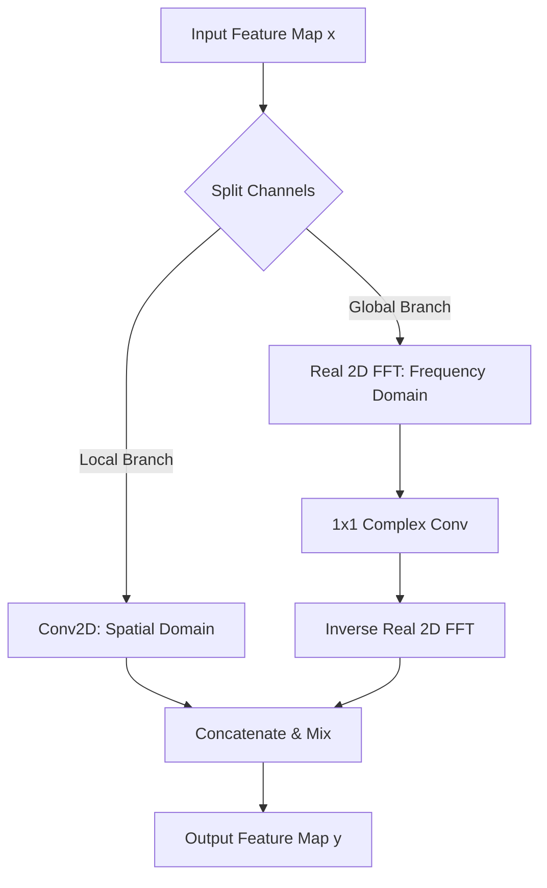
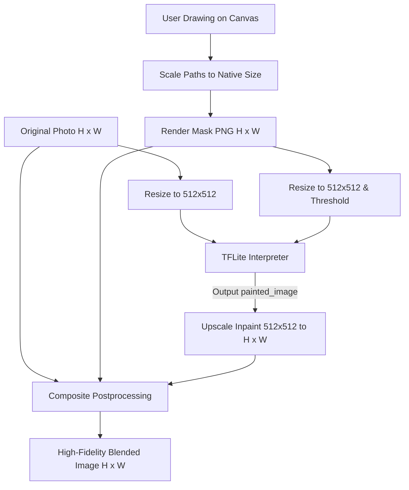

# LaMa-Dilated Image Inpainting on Flutter

A premium Flutter application demonstrating real-time, on-device image inpainting using the **LaMa-Dilated** (Large Mask Inpainting with Dilated Fast Fourier Convolutions) TFLite model.

---

## Technical Overview: How LaMa-Dilated Works

Traditional convolutional neural networks (CNNs) struggle with image inpainting because they rely on localized receptive fields. When erasing large structures, standard convolutions require stacking dozens of layers to propagate context from the boundary to the center. This results in blurry infills, lost structural lines, and high computational costs.

**LaMa (Large Mask Inpainting)** solves this by utilizing **Fast Fourier Convolutions (FFCs)**, which grant the model a **global receptive field** from the very first layer.



### 1. Fast Fourier Convolution (FFC)
FFC splits the input channels into two parallel branches: a **local branch** (spatial domain) and a **global branch** (spectral domain).

Let the input tensor be $x$. It is divided along channels:
$$x = (x_L, x_G)$$

* **Local Branch ($x_L$)**: Processes local textures using standard spatial 2D convolutions.
* **Global Branch ($x_G$)**: Captures global structure by transforming the features into the frequency domain:
  1. **Forward Transform**: Convert spatial features to the frequency domain using a Real 2D Fast Fourier Transform (RFFT):
     $$X_G = \mathcal{F}(x_G) \in \mathbb{C}^{H \times W/2 \times C}$$
  2. **Spectral Convolution**: Apply complex-valued convolution (represented as $R$ below) to adjust amplitudes and phases of all frequencies simultaneously:
     $$Y_G^{freq} = R(X_G)$$
  3. **Inverse Transform**: Transform back to spatial features using the Inverse RFFT:
     $$y_G^{spatial} = \mathcal{F}^{-1}(Y_G^{freq})$$
  4. **Cross-Branch Information Exchange**: Both branches exchange features via downsampling/upsampling and convolutions to combine local detail and global context.

The resulting output features are concatenated:
$$y = (y_L, y_G)$$

### 2. Dilated Convolutions
The **LaMa-Dilated** variant uses dilated kernels in its spatial convolutions. Dilated convolutions introduce spacing between the kernel elements:
$$\text{Output}(i, j) = \sum_{m} \sum_{n} \text{Kernel}(m, n) \times \text{Input}(i + d \cdot m, j + d \cdot n)$$
where $d$ is the dilation rate. This exponentially expands the spatial receptive field without increasing the parameter count, making it highly effective at inpainting lines, horizons, and textures on-device.

---

## Complete Inpaint & Blending Pipeline



### High-Fidelity Composite Math
Because the model runs at a fixed resolution of $512 \times 512$, raw output would suffer from quality loss when applied to high-resolution camera photos. 

To overcome this, we implement a **High-Fidelity Composite Blending** step. We upscale the $512 \times 512$ model output back to the original image dimensions $H \times W$ and blend it using the original high-resolution drawing mask:

$$\text{Output}(x,y) = M(x,y) \cdot I_{inpainted}(x,y) + \big(1 - M(x,y)\big) \cdot I_{original}(x,y)$$

where:
* $M(x,y) \in [0, 1]$ is the mask intensity (with $1.0$ representing painted pixels to erase, and $0.0$ representing original pixels to keep).
* $I_{inpainted}(x,y)$ is the upscaled model output.
* $I_{original}(x,y)$ is the original high-resolution photo.

This ensures that the **unmasked areas retain 100% of their native resolution and sharpness**, while only the erased areas are filled with the upscaled model prediction.

---

## Model Specifications

The TFLite model has the following input/output tensor signature:

### Inputs
1. **`image`**:
   - **Shape**: `[1, 512, 512, 3]` (Batch Size, Height, Width, Channels)
   - **Type**: `float32`
   - **Value Range**: `[0.0, 1.0]` (Normalized RGB channels)
2. **`mask`**:
   - **Shape**: `[1, 512, 512, 1]` (Batch Size, Height, Width, Channels)
   - **Type**: `float32`
   - **Value Range**: `[0.0, 1.0]` (Binary single-channel mask: `1.0` = erase, `0.0` = keep)

### Outputs
1. **`painted_image`**:
   - **Shape**: `[1, 512, 512, 3]`
   - **Type**: `float32`
   - **Value Range**: `[0.0, 1.0]` (Inpainted RGB channels)

---

## Flutter Implementation Details

### Asynchronous Isolate Processing
To prevent frame drops and keep the UI thread running at 60/120 FPS, the preprocessing (resizing, scaling, normalization) and postprocessing (bilinear upscaling, mask blending, JPEG encoding) are offloaded to **Background Dart Isolates** via `compute(...)`. 

```
[Main UI Thread] --(Dispatch bytes)--> [Preprocess Isolate] --(Float32Lists)--> [Main UI Thread (Runs TFLite)] --(Float32 Output)--> [Postprocess Isolate] --(JPEG Bytes)--> [Main UI Thread]
```

### Interactive Editor & Coordinate Translation
Since photos are scaled to fit the device screen, screen-space touch coordinates cannot be mapped directly. We compute the aspect-ratio scale factor and offset between the display container and the native image:
```dart
double scale = displayWidth / nativeWidth;
double offsetX = (containerWidth - displayWidth) / 2;
double offsetY = (containerHeight - displayHeight) / 2;

double nativeX = (touchX - offsetX) / scale;
double nativeY = (touchY - offsetY) / scale;
```
By storing touch paths directly in **native coordinates**, the drawing remains perfectly anchored during zoom/pan, and we can render the mask at the exact native resolution.

---

## How to Run

1. Navigate to the project directory:
   ```bash
   cd example/lama_dilated
   ```
2. Fetch dependencies:
   ```bash
   flutter pub get
   ```
3. Run the project:
   ```bash
   flutter run
   ```
   *Note: During development, the service checks for the local model file at `/Users/mdshahidulislam/Documents/resource/flutter-tflite/allmodel/lama_dilated-tflite-float/lama_dilated.tflite` on macOS.*
