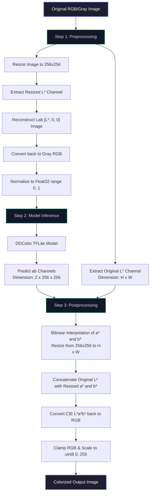

# DDColor Image Colorization: Technical Deep Dive & Architecture

This document provides a comprehensive mathematical and architectural explanation of how the **DDColor** TFLite model colorizes grayscale (black-and-white) images.

---

## 1. Core Concept: CIE $L^*a^*b^*$ Color Space vs. RGB

In standard digital displays, images are represented in the **RGB** (Red, Green, Blue) color space. However, RGB is highly correlated: changing the intensity of a color also changes the brightness of the pixel. This coupling makes it extremely difficult for a deep learning model to learn realistic colorization directly in RGB.

To decouple brightness from color, we use the **CIE $L^*a^*b^*$** color space:
- **$L^*$ (Luminance)**: Represents the lightness of a pixel, ranging from `0` (black) to `100` (white). This is essentially the black-and-white version of the image.
- **$a^*$ (Chrominance A)**: Represents the color position along the green-red axis (negative values are green, positive values are red/magenta).
- **$b^*$ (Chrominance B)**: Represents the color position along the blue-yellow axis (negative values are blue, positive values are yellow).

```
                      + L* (Lightness 100)
                       |
                       |       + b* (Yellow)
                       |      /
      - a* (Green) ----+----+---- + a* (Red)
                      /|
                     / |
         - b* (Blue)   |
                       |
                      - L* (Darkness 0)
```

By using the $L^*a^*b^*$ space, the colorization task is simplified:
1. **Given**: The $L^*$ channel (extracted from the black-and-white input).
2. **Goal**: Predict the $a^*$ and $b^*$ channels using the DDColor neural network.
3. **Reconstruction**: Combine the original high-resolution $L^*$ channel with the predicted $a^*$ and $b^*$ channels, then convert back to sRGB. 

*Benefit:* Because the original $L^*$ channel is preserved, the output image retains $100\%$ of its original sharpness, texture, and high-frequency details.

---

## 2. End-to-End Pipeline Data Flow

The following diagram illustrates how an input image is processed through the preprocessing, model execution, and postprocessing phases:



---

## 3. Mathematical Foundations & Conversions

### A. Preprocessing: RGB $\rightarrow$ CIE $L^*a^*b^*$

To convert an sRGB pixel to CIE $L^*a^*b^*$, we must first linearize the RGB values (remove gamma correction) and convert to the CIE XYZ color space.

#### 1. Gamma Decoding (sRGB $\rightarrow$ Linear RGB)
For each channel $V \in \{R, G, B\}$ normalized to $[0, 1]$:
$$V_{\text{linear}} = \begin{cases} 
\frac{V_{\text{sRGB}}}{12.92} & \text{if } V_{\text{sRGB}} \le 0.04045 \\
\left(\frac{V_{\text{sRGB}} + 0.055}{1.055}\right)^{2.4} & \text{if } V_{\text{sRGB}} > 0.04045 
\end{cases}$$

#### 2. Linear RGB $\rightarrow$ CIE XYZ (D65 Reference White)
$$\begin{bmatrix} X \\ Y \\ Z \end{bmatrix} = \begin{bmatrix} 
0.412453 & 0.357580 & 0.180423 \\
0.212671 & 0.715160 & 0.072169 \\
0.019334 & 0.119193 & 0.950227 
\end{bmatrix} \begin{bmatrix} R_{\text{linear}} \\ G_{\text{linear}} \\ B_{\text{linear}} \end{bmatrix}$$

#### 3. CIE XYZ $\rightarrow$ CIE $L^*a^*b^*$
Using reference white values for D65 illuminant:
$X_n = 0.950456, \quad Y_n = 1.0, \quad Z_n = 1.088754$

Normalize coordinates:
$$x_r = \frac{X}{X_n}, \quad y_r = \frac{Y}{Y_n}, \quad z_r = \frac{Z}{Z_n}$$

Apply the non-linear transfer function $f(t)$:
$$f(t) = \begin{cases} 
t^{1/3} & \text{if } t > 0.008856 \\
7.787 t + \frac{16}{116} & \text{if } t \le 0.008856 
\end{cases}$$

Calculate the $L^*a^*b^*$ coordinates:
$$L^* = 116 f(y_r) - 16$$
$$a^* = 500 \left[ f(x_r) - f(y_r) \right]$$
$$b^* = 200 \left[ f(y_r) - f(z_r) \right]$$

---

### B. Postprocessing: CIE $L^*a^*b^*$ $\rightarrow$ RGB

During postprocessing, we combine the original $L^*$ channel with the model-predicted $a^*$ and $b^*$ channels, and reverse the conversions.

#### 1. CIE $L^*a^*b^*$ $\rightarrow$ CIE XYZ
Compute the intermediate terms:
$$f_y = \frac{L^* + 16}{116}$$
$$f_x = f_y + \frac{a^*}{500}$$
$$f_z = f_y - \frac{b^*}{200}$$

Compute normalised XYZ coordinates:
$$x_r = \begin{cases} 
f_x^3 & \text{if } f_x^3 > 0.008856 \\
\frac{f_x - 16/116}{7.787} & \text{if } f_x^3 \le 0.008856 
\end{cases}$$

$$y_r = \begin{cases} 
f_y^3 & \text{if } f_y^3 > 0.008856 \\
\frac{f_y - 16/116}{7.787} & \text{if } f_y^3 \le 0.008856 
\end{cases}$$

$$z_r = \begin{cases} 
f_z^3 & \text{if } f_z^3 > 0.008856 \\
\frac{f_z - 16/116}{7.787} & \text{if } f_z^3 \le 0.008856 
\end{cases}$$

Restore reference white scaling:
$$X = x_r \times 0.950456, \quad Y = y_r \times 1.0, \quad Z = z_r \times 1.088754$$

#### 2. CIE XYZ $\rightarrow$ Linear RGB
$$\begin{bmatrix} R_{\text{linear}} \\ G_{\text{linear}} \\ B_{\text{linear}} \end{bmatrix} = \begin{bmatrix} 
3.240479 & -1.537150 & -0.498535 \\
-0.969256 & 1.875992 & 0.041556 \\
0.055648 & -0.204043 & 1.057311 
\end{bmatrix} \begin{bmatrix} X \\ Y \\ Z \end{bmatrix}$$

#### 3. Gamma Encoding (Linear RGB $\rightarrow$ sRGB)
For each channel $C \in \{R_{\text{linear}}, G_{\text{linear}}, B_{\text{linear}}\}$:
$$C_{\text{sRGB}} = \begin{cases} 
12.92 \times C & \text{if } C \le 0.0031308 \\
1.055 \times C^{1/2.4} - 0.055 & \text{if } C > 0.0031308 
\end{cases}$$

Finally, we clamp $C_{\text{sRGB}}$ to $[0.0, 1.0]$ and scale to $[0, 255]$:
$$\text{PixelValue} = \lfloor \text{clamp}(C_{\text{sRGB}}, 0.0, 1.0) \times 255.0 \rceil$$

---

## 4. Bilinear Interpolation for Chrominance Upsampling

Since the DDColor model operates at $256 \times 256$, the predicted $a^*$ and $b^*$ channels must be upsampled to the original image dimensions $H \times W$. 

To do this smoothly, we use **bilinear interpolation**. For any target coordinate $(x, y)$ corresponding to a source coordinate $(x_s, y_s)$ where $x_1 \le x_s \le x_2$ and $y_1 \le y_s \le y_2$:

1. Compute distance ratios:
   $$dx = x_s - x_1$$
   $$dy = y_s - y_1$$

2. Interpolate the value $P(x, y)$ from the surrounding four source pixels:
   $$P(x, y) = (1 - dx)(1 - dy)P(x_1, y_1) + dx(1 - dy)P(x_2, y_1) + (1 - dx)dy P(x_1, y_2) + dx dy P(x_2, y_2)$$

We implemented a highly optimized version of this in Dart using **1D precomputed weight tables** for $x$ and $y$ dimensions, achieving $O(H \times W)$ execution time and avoiding redundant division and mapping inside the inner pixel loop.

---

## 5. Model Architecture: DDColor (Dual Decoders)

DDColor (Towards Photo-Realistic Image Colorization via Dual Decoders) solves colorization by utilizing two separate decoders working in parallel.

### A. Model Input
The TFLite model expects a single input tensor containing a grayscale image represented in the RGB color space:
- **Tensor Name**: `image`
- **Tensor Shape**: `[1, 256, 256, 3]` (NHWC format)
- **Data Type**: `Float32`
- **Value Range**: `[0.0, 1.0]`

During preprocessing, the input image is converted to the CIE $L^*a^*b^*$ color space, and a neutral grayscale representation is constructed by keeping the luminance channel $L^*$ and setting chromaticity channels $a^*$ and $b^*$ to zero ($a^*=0, b^*=0$). This gray LAB image is converted back to sRGB and normalized to `[0.0, 1.0]` before running inference.

### B. Parallel Processing Pathways
Traditional colorization models suffer from color bleeding and desaturation. DDColor resolves this with a dual-path structure:

```
                       +-----------------------------+
                       |    Input Gray Image (RGB)   |
                       |       Shape: [256, 256, 3]  |
                       +--------------+--------------+
                                      |
                                      v
                       +-----------------------------+
                       |      Backbone Encoder       |
                       +--------------+--------------+
                                      |
              +-----------------------+-----------------------+
              |                                               |
              v (Multi-scale Features)                        v (Bottleneck Features)
     +-----------------+                             +-----------------+
     |  Pixel Decoder  |                             |  Color Decoder  |
     |  (Local Path)   |                             |  (Global Path)  |
     |                 |                             |                 |
     | - Upsampling    |                             | - Color Queries |
     | - Convolutions  |                             | - Transformer   |
     | - Skip Connects |                             |   Cross-Attention|
     +--------+--------+                             +--------+--------+
              |                                               |
              +-----------------------+-----------------------+
                                      | (Feature Fusion / Dot Product)
                                      v
                       +-----------------------------+
                       |      Output Projection      |
                       +--------------+--------------+
                                      |
                                      v
                       +-----------------------------+
                       |    Predicted ab Channels    |
                       |      Shape: [2, 256, 256]   |
                       +-----------------------------+
```

1. **Pixel Decoder (Local Pathway)**:
   - Takes intermediate multi-scale feature maps from the backbone network and progressively upsamples them using convolutions and skip-connections.
   - Generates a high-resolution spatial feature map of shape `[C_spatial, 256, 256]` that preserves sharp geometric boundaries, edge details, and textures.
2. **Color Decoder (Global Pathway)**:
   - Utilizes a set of learnable **Color Queries** (typically 100 to 200 dense vectors representing prototypical color categories).
   - Uses Transformer cross-attention layers to allow queries to scan bottleneck image features:
     $$\text{Attention}(Q, K, V) = \text{softmax}\left(\frac{Q K^T}{\sqrt{d_k}}\right) V$$
   - Learns category-aware color semantics (e.g., distinguishing "sky" from "grass" or "skin") to prevent color bleeding across unrelated boundaries.

### C. Feature Fusion
The global color embeddings from the Color Decoder and the local spatial features from the Pixel Decoder are fused (using a dot product or projection layers). This precisely injects the predicted semantic colors into the geometric boundaries defined by the Pixel Decoder.

### D. Model Output
The model outputs a single tensor containing the predicted chrominance values:
- **Tensor Name**: `output`
- **Tensor Shape**: `[1, 2, 256, 256]` (representing `[Batch, Channels, Height, Width]` - NCHW layout)
- **Data Type**: `Float32`
- **Channels**:
  - **Channel 0**: The predicted $a^*$ channel (green-red chromaticity), ranging roughly from $-128.0$ to $+127.0$.
  - **Channel 1**: The predicted $b^*$ channel (blue-yellow chromaticity), ranging roughly from $-128.0$ to $+127.0$.

In post-processing, these predicted $a^*b^*$ channels are bilinearly interpolated back to the original image dimensions ($H \times W$), merged with the original high-resolution $L^*$ channel, and converted back to sRGB.
